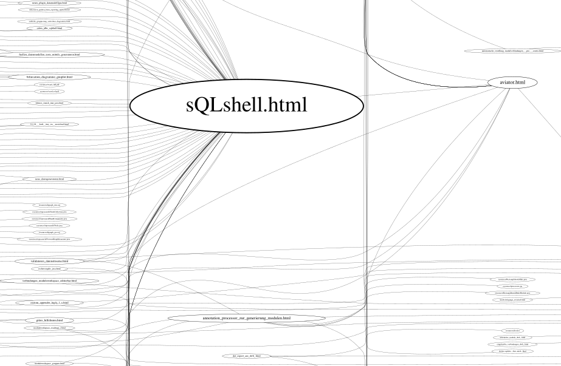
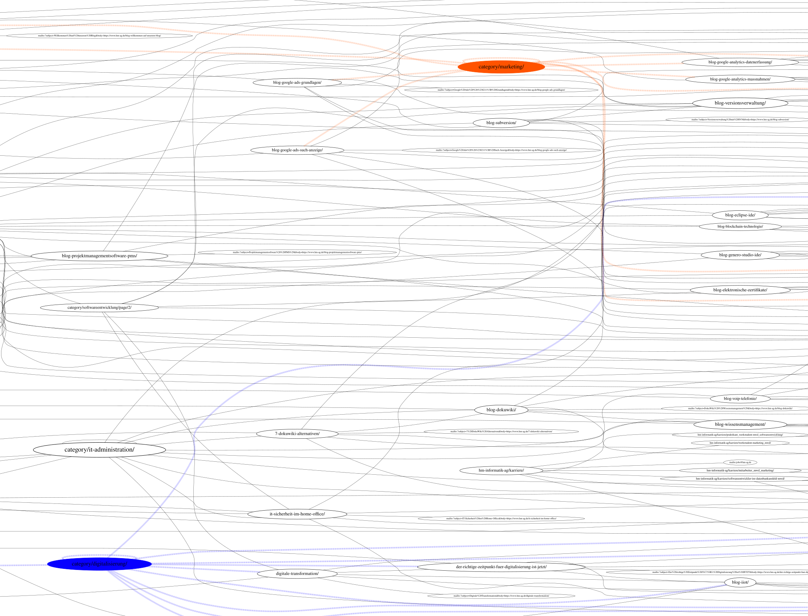

# warc2sitemap

<!---
[](http://www.ted.com/talks/simon_sinek_how_great_leaders_inspire_action)
--->
[](https://GitHub.com/elbosso/warc2sitemap/releases/)
[](https://GitHub.com/elbosso/warc2sitemap/tags/)
[](https://github.com/elbosso/warc2sitemap/blob/master/LICENSE)
[](https://GitHub.com/elbosso/warc2sitemap/issues/)
[](https://GitHub.com/elbosso/warc2sitemap/issues?q=is%3Aissue+is%3Aclosed)
[](https://github.com/elbosso/warc2sitemap/issues)
[](https://GitHub.com/elbosso/warc2sitemap/graphs/contributors/)
[](https://github.com/elbosso/warc2sitemap)
[](https://elbosso.github.io/)

## Overview

This project is intended to turn a [WARC file](https://en.wikipedia.org/wiki/Web_ARChive) into a sitemap or into something (a graph description)
one could build a sitemap from. The first release only offers to create a [Graphviz](https://graphviz.org/) file that can 
then be rendered - for example into [SVG](https://en.wikipedia.org/wiki/Scalable_Vector_Graphics).

## Inner workings

WARC files can be created for example by using [wget](https://wiki.archiveteam.org/index.php/Wget_with_WARC_output). The application 
currently supports uncompressed as well as compressed WARC files.

* The WARC file is scanned for *response* objects
* Of those found, only the ones having media type *text/html* are considered
* The path of the URLs of those remaining is then checked against the regular expressions on the whitelist (if such are given)
* If the path matches at least one of the expressions or none are given, it is matched against the egular expressions on the blacklist (if such are given)
* If the path matches none of those expressions - ore none are given, the body of the response is then loaded and filtered:
* For each xpath from the list of xpaths to search, the xpath is expanded by _//a/@href_ and then applied to the body (if no xpaths are given, only _//a/@href_ is applied)
* From the result of the combined xpath queries, doubles are removed
* The remaining paths are subjected to the blacklist/whitelist regime mentioned above and the ones not matching any whitelist entry or matching any blacklist entry are pruned
* Then what is left is the collection of pages the currently analyzed one is connected to

The whitelist, blacklist and list of xpaths to search can be configured by writing textfiles where each line contains exactly one item. Examples
for that can be found inside directory _examples_.

It is possible to give one more configuration file - a list of patterns to highlight. Every node matching a pattern in this file gets a random
color assigned - the node itself gets this color as background and every edge terminating at this node is drawn dashed instead of solid using
this color (and a thicker pen stroke).

Labels can sometimes unseemly long and thus the nodes in the graph become rather wide. To circumvent this,
two optional parameters are recognized: a string containing characters where it is allowed to 
insert line breaks into labels given with `-c` and a ratio (given with `-r` and `.` as decimal point): if this ratio is enlarged,
linebreaks inside label occur more often and as a result, the lines are shorter. A sensible default is 0.1 for this parameter.
if either one of those two parameters is omitted, line breaking inside labels is not active.


## Build
```shell
mvn -U package assembly:single
```

## Run
```shell
$JAVA_HOME/bin/java -jar target/warc2sitemap-<version>-jar-with-dependencies.jar \
-w examples/whitelist.txt -b examples/blacklist.txt -x examples/xpathsToSearch.txt \
-i input.warc -o output.gv
```

## Render

After rendering it using for example
```shell
dot -Tsvg /tmp/output.gv >/tmp/sitemap.svg
```

the resulting output looks like this (cutout from a much larger sitemap of [elbosso.github.io](https://elbosso.github.io))



As should be obvious: the line thickness of the bubble, the fontsize of the label inside the bubble and the margin around the label inside the bubble grow with the numbers of connections for each bubble.

Here is another example, highlighting two nodes and their connections:


